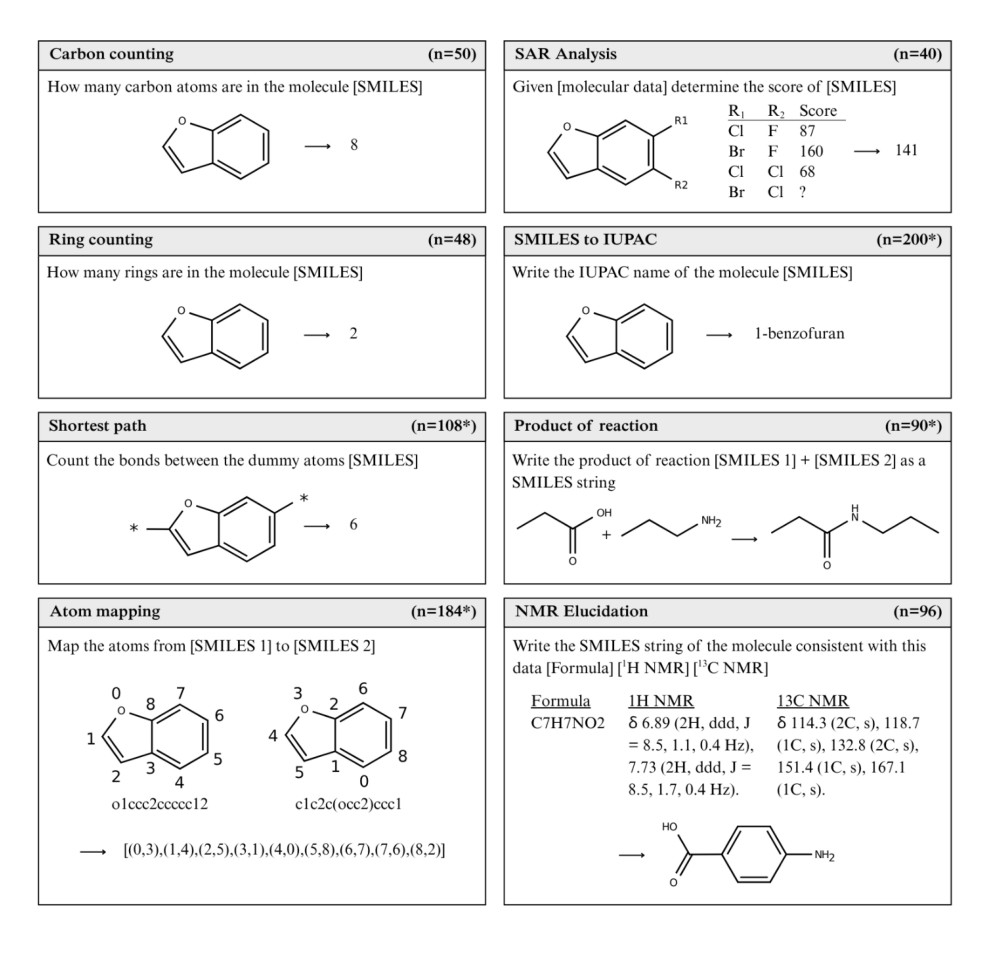

# ChemIQ
Assessing the Chemical Intelligence of Large Language Models

<p align="center"></p>

## Quick start
All benchmark items are stored in questions/chemiq.jsonl. The workflow is split accross three Jupyter notebooks. 

```bash
conda create -n ChemIQ python=3.11 numpy pandas matplotlib scipy requests openai rdkit -c conda-forge
```

| Notebook | Purpose |
|----------|---------|
| **`1_load_and_submit_questions.ipynb`** | Loads the JSONL file and shows how to batch-submit the prompts to the OpenAI API. |
| **`2_process_results.ipynb`** | Parses the raw completions, applies the scoring rubric, and writes a tidy results file. |
| **`3_data_analysis.ipynb`** | Aggregates the scores and recreates all figures reported in the manuscript. |


## Benchmark construction
ChemIQ consists of algorithmically generated questions from eight distinct tasks:

<p align="center"></p>

**Figure 1:** Question categories in the ChemIQ benchmark. The number of questions in each category is shown in the panel header, and * indicates the set contains 50% canonical and 50% randomized SMILES.

| question_category   | Task                                                                 | Purpose                                                      |
|---------------------|----------------------------------------------------------------------|------------------------------------------------------------------|
| `carbon_count`        | How many carbon atoms are in the molecule [SMILES]                   | Counting characters is a basic requirement for interpreting SMILES strings.|
| `ring_count`          | How many rings are in the molecule [SMILES]                          | Testing basic requirement for interpreting SMILES string. This can be solved by counting the "ring number" characters in the SMILES and dividing by 2.|
| `shortest_path`       | Count the bonds between the dummy atoms [SMILES]                     | Interpreting graph based features from SMILES strings   |
| `atom_mapping`        | Map the atoms from [SMILES 1] to [SMILES 2]                          | Understanding graph isomorphism - that is, two different SMILES strings can represent the same molecule. Doing this indicates an ability to navigate and interpret the molecular graph.|
| `smiles_to_iupac`     | Write the IUPAC name of the molecule [SMILES]                        | Task requires interpreting molecular graph and then writing this in natural language. Demonstrates ability to describe functional groups and their relative positioning to eachother|
| `sar_inference`       | Given [molecular data] determine the score of [SMILES]               | Shows ability to extract molecular features, assign values, then generalise this to an unseen molecules|
| `reaction_prediction` | Write the product of reaction [SMILES 1] + [SMILES 2] as a SMILES string | This task is primarly focused on interpreting basic chemical reactions from SMILES and then applying to correct transformation to write the SMILES string of the product. These reaction questions are "easy" for a chemist and do not test other reaction prediction factors like selectivity, stereochemistry, reaction conditions etc.|
| `nmr_elucidation`     | Write the SMILES string of the molecule consistent with this data [Formula] [¹H NMR] [¹³C NMR] | This task is our most advanced task for interpreting molecular structures. This requires mapping of NMR features to local chemical structures, then combining them together consistent with the NMR data.|

### Question sets
| File Path | Description |
|---|---|
| `questions/chemiq.jsonl`| Main benchmark consiting of 796 questions.|
| `questions/additional_smiles_to_iupac.jsonl`| Additional questions used for error analysis of SMILES to IUPAC task (functional group naming and locant numbering).|
| `questions/smiles_to_iupac_zinc_randomized_100.jsonl`| 100 SMILES to IUPAC questions using randomized SMILES. If you only want to run a small number of questions, these give a good indication of molecular comprehension.|

### Question Schema
Each line in the .jsonl is a single question encoded as a Python dictionary:

```
{'uuid': 'cbfe1b13-aadb-40e4-838d-388c8878e3ee',
 'question_category': 'counting_carbon',
 'sub_category': None,
 'meta_data': {'smiles': 'Nc1nnc(SC(F)F)s1',
  'smiles_random': 'S(c1sc(N)nn1)C(F)F',
  'carbon_count': 3},
 'prompt': 'How many carbon atoms are in the molecule:\n\nS(c1sc(N)nn1)C(F)F\n\nGive your answer as an integer. Do not write any comments.',
 'answer': 3,
 'answer_format': 'integer',
 'answer_range': None,
 'verification_method': 'exact_match',
 'ChemIQ': True}
```

